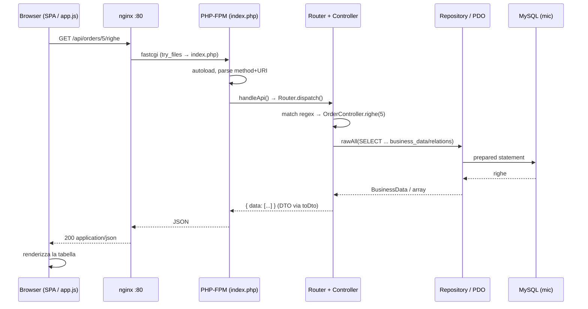

# MIC — Architettura

> Cosa gira, e come una richiesta viaggia dal browser a MySQL e ritorno.
> Evidenze: `docker-compose.yml`, `Dockerfile`, `nginx.conf`, `php-app/index.php`, `php-app/public/*`.


*(Diagramma: [`architecture.svg`](./architecture.svg). La sequenza Mermaid più sotto è lo stesso flusso in forma testuale.)*

## Componenti in esecuzione

Tre container, una rete Docker (`docker-compose.yml`):

| Container | Immagine / build | Porta (host→cont.) | Ruolo |
|---|---|---|---|
| `mic-app` | build da `Dockerfile` | `8088 → 80` | Tutta l'app: nginx + PHP-FPM in **un'unica** immagine, avviati da `supervisord`. |
| `mic-mysql` | `mysql:8.0` | `3306 → 3306` | L'unico datastore. Schema + seed caricati automaticamente al primo boot. |
| `mic-adminer` | `adminer:latest` | `8082 → 8080` | Browser web per il DB (comodità di sviluppo, non parte dell'app). |

### Dentro `mic-app` (immagine unica, didattica)
Il `Dockerfile` costruisce `php:8.2-fpm-alpine`, aggiunge `nginx`, `supervisor`, `pdo_mysql` e un `supervisord.conf` che avvia **due** processi affiancati:

- **nginx** (`:80`) — serve gli asset statici e fa reverse-proxy di tutto il resto verso PHP-FPM (`nginx.conf`).
- **php-fpm** (`:9000`) — esegue il front controller PHP.

**Niente Composer**: `index.php` registra un piccolo autoloader stile PSR (`index.php:34`). **Niente framework**: routing, accesso al DB e SPA sono tutti scritti a mano.

### Frontend
Una single-page app in vanilla JS servita come file statici da `php-app/public/`:
- `index.html` — lo shell: sidebar nav + topbar + `<main id="view">`, più uno `<script>` per schermata.
- `js/app.js` — il "framework" fatto in casa: hash router, wrapper `fetch` (`api/get/post/put/del`) e gli helper riusabili `listView`, `buildForm`, `modal`, `toast`.
- `js/<entità>.js` — un file per schermata, ciascuno chiama `MIC.registerView(...)`.
- Chart.js è caricato da **CDN** (`index.html:9`) — l'unica dipendenza runtime esterna.

### Database
Un solo schema MySQL `mic` con **due** tabelle (`database/schema.sql`): `business_data` e `business_relations`. Al primo boot, `schema.sql` e poi `seed.sql` vengono montati in `/docker-entrypoint-initdb.d/` ed eseguiti in ordine alfabetico (`docker-compose.yml:28-30`). Le credenziali sono `root/root`; l'app le legge dall'env (`Database.php:22-26`).

## Come scorre una richiesta

nginx decide prima statico-vs-PHP (`nginx.conf`):
- `/css/*`, `/js/*`, `/favicon.ico` → serviti direttamente da disco.
- tutto il resto → `try_files $uri /index.php?$query_string` → PHP-FPM.

`index.php` poi ramifica sul path (`index.php:43-74`):
- `/api/*` → `handleApi()` (JSON).
- qualsiasi altra cosa → restituisce lo shell SPA `public/index.html`.

### Esempio: `GET /api/orders/5/righe` (righe d'ordine)

```
Browser (orders.js: fetch)
   │  GET /api/orders/5/righe
   ▼
nginx :80  ── non /css|/js ──► try_files ► /index.php  ──fastcgi──►  php-fpm :9000
   ▼
index.php  ── uri inizia con /api/ ──►  handleApi()
   ▼
Router::dispatch("GET", "/api/orders/5/righe")        (Router.php:36)
   │  la regex matcha  /api/orders/:id/righe
   ▼
OrderController::righe(5)                              (OrderController.php:85)
   │  SQL grezzo su business_data + business_relations
   ▼
Repository::rawAll(...)  ──►  Database::get() (PDO singleton)  ──►  MySQL
   ▲
   │  righe → array DTO
   ▼
{ "data": [ ...righe... ] }  ──json──►  php-fpm ──► nginx ──► il Browser renderizza la <table>
```

### Sequenza (Mermaid)



## Convenzioni API (su cui si appoggia la SPA)

- **Lista**: `{ "data": [...], "meta": { "total", "limit", "offset" } }` — costruito da `BaseController::index()`.
- **Singolo / scrittura**: `{ "data": {...} }`.
- **Errore**: `{ "error": "...", ... }` con HTTP 400/404/500 (`index.php:137-158`).
- Un handler può restituire `[status, body]`; altrimenti il Router usa di default `200` (`Router.php:47-51`).
- La tabella delle rotte viene costruita da zero **a ogni richiesta** in `handleApi()` (`index.php:84-135`): un helper generico `$crud` cabla `GET/POST/PUT/DELETE` per entità, più alcune sotto-rotte custom (`/orders/:id/righe`, `/listini/:id/voci`, `/magazzini/:id/giacenze`, `/invoices/:id/invia-sdi`, `/customers/:id/orders|invoices`).

## Sintesi in un paragrafo

Una SPA nel browser (vanilla JS, routing via hash) parla JSON con un singolo container PHP in cui nginx sta davanti a PHP-FPM. PHP non ha framework né ORM: un front controller scritto a mano dispatcha verso ~17 controller sottili, che leggono e scrivono **tutti le stesse due tabelle generiche** attraverso un unico `Repository`. MySQL è l'unica fonte di verità. La complessità interessante **non** è nell'idraulica (uniforme e semplice) — è nel fatto che ogni controller codifica, a mano, cosa "significano" le colonne generiche per la sua entità. È questa la cucitura che il resto del lab attacca.
