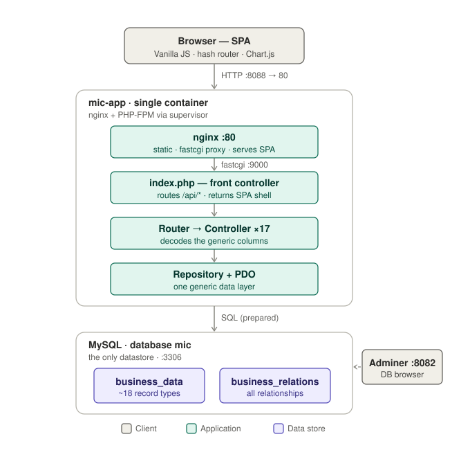
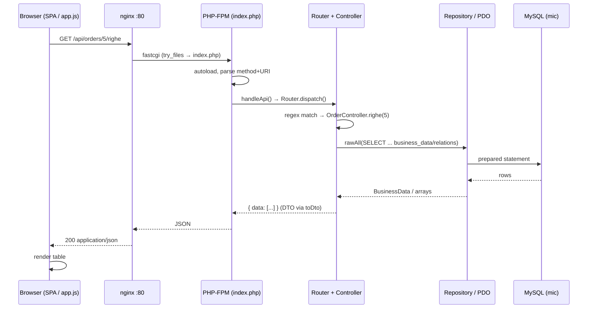

# MIC — Architecture

> What runs, and how a request travels from the browser to MySQL and back.
> Evidence: `docker-compose.yml`, `Dockerfile`, `nginx.conf`, `php-app/index.php`, `php-app/public/*`.



*(Diagram: [`architecture.svg`](./architecture.svg). The Mermaid sequence below is the same flow in text form.)*

## Running components

Three containers, one Docker network (`docker-compose.yml`):

| Container | Image / build | Port (host→cont.) | Role |
|---|---|---|---|
| `mic-app` | built from `Dockerfile` | `8088 → 80` | The whole app: nginx + PHP-FPM in **one** image, run by `supervisord`. |
| `mic-mysql` | `mysql:8.0` | `3306 → 3306` | The only datastore. Schema + seed auto-loaded on first boot. |
| `mic-adminer` | `adminer:latest` | `8082 → 8080` | Web DB browser (dev convenience, not part of the app). |

### Inside `mic-app` (single image, didactic)
`Dockerfile` builds `php:8.2-fpm-alpine`, adds `nginx`, `supervisor`, `pdo_mysql`, and a `supervisord.conf` that runs **two** processes side by side:

- **nginx** (`:80`) — serves static assets and reverse-proxies everything else to PHP-FPM (`nginx.conf`).
- **php-fpm** (`:9000`) — runs the PHP front controller.

There is **no Composer**: `index.php` registers a tiny PSR-style autoloader (`index.php:34`). There is **no framework**: routing, DB access, and the SPA are all hand-rolled.

### Frontend
A vanilla-JS single-page app served as static files from `php-app/public/`:
- `index.html` — the shell: sidebar nav + topbar + `<main id="view">`, plus one `<script>` per screen.
- `js/app.js` — the home-grown "framework": hash router, `fetch` wrapper (`api/get/post/put/del`), and reusable `listView`, `buildForm`, `modal`, `toast` helpers.
- `js/<entity>.js` — one file per screen, each calling `MIC.registerView(...)`.
- Chart.js is pulled from a **CDN** (`index.html:9`) — the one external runtime dependency.

### Database
A single MySQL schema `mic` with **two** tables (`database/schema.sql`): `business_data` and `business_relations`. On first boot, `schema.sql` then `seed.sql` are mounted into `/docker-entrypoint-initdb.d/` and run alphabetically (`docker-compose.yml:28-30`). Credentials are `root/root`; the app reads them from env (`Database.php:22-26`).

## How a request flows

nginx decides static-vs-PHP first (`nginx.conf`):
- `/css/*`, `/js/*`, `/favicon.ico` → served straight from disk.
- everything else → `try_files $uri /index.php?$query_string` → PHP-FPM.

`index.php` then branches on the path (`index.php:43-74`):
- `/api/*` → `handleApi()` (JSON).
- anything else → returns the SPA shell `public/index.html`.

### Example: `GET /api/orders/5/righe` (order lines)

```
Browser (orders.js: fetch)
   │  GET /api/orders/5/righe
   ▼
nginx :80  ── not /css|/js ──► try_files ► /index.php  ──fastcgi──►  php-fpm :9000
   ▼
index.php  ── uri starts with /api/ ──►  handleApi()
   ▼
Router::dispatch("GET", "/api/orders/5/righe")        (Router.php:36)
   │  regex matches  /api/orders/:id/righe
   ▼
OrderController::righe(5)                              (OrderController.php:85)
   │  raw SQL over business_data + business_relations
   ▼
Repository::rawAll(...)  ──►  Database::get() (PDO singleton)  ──►  MySQL
   ▲
   │  rows → DTO array
   ▼
{ "data": [ ...lines... ] }  ──json──►  php-fpm ──► nginx ──► Browser renders <table>
```

### Sequence (Mermaid)



## API conventions (what the SPA relies on)

- **List**: `{ "data": [...], "meta": { "total", "limit", "offset" } }` — built by `BaseController::index()`.
- **Single / write**: `{ "data": {...} }`.
- **Error**: `{ "error": "...", ... }` with HTTP 400/404/500 (`index.php:137-158`).
- A handler may return `[status, body]`; otherwise the Router defaults to `200` (`Router.php:47-51`).
- The route table is built fresh **on every request** in `handleApi()` (`index.php:84-135`): a generic `$crud` helper wires `GET/POST/PUT/DELETE` per entity, plus a handful of custom sub-routes (`/orders/:id/righe`, `/listini/:id/voci`, `/magazzini/:id/giacenze`, `/invoices/:id/invia-sdi`, `/customers/:id/orders|invoices`).

## One-paragraph summary

A browser SPA (vanilla JS, hash-routed) talks JSON to a single PHP container where nginx fronts PHP-FPM. PHP has no framework and no ORM: a hand-written front controller dispatches to ~17 thin controllers, all of which read and write **the same two generic tables** through one shared `Repository`. MySQL is the single source of truth. The interesting complexity is **not** in the plumbing (which is uniform and simple) — it is in the fact that every controller encodes, by hand, what the generic columns "mean" for its entity. That is the seam the rest of the lab attacks.
