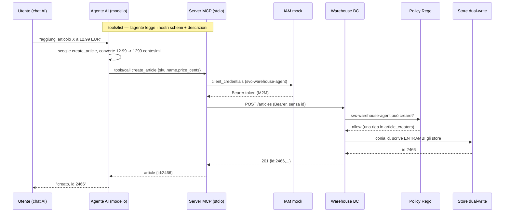

# Restituzione — Fase 11: il Warehouse BC parla in tool (Gruppo 3)

> English version: [`restitution.md`](./restitution.md)
> Script parlato per la restituzione di CP11 (~4 min). Confrontiamo la *forma*, non la sintassi.

## Apertura
Siamo il Gruppo 3. CP7 aveva dato al BC una busta di identità e la prima policy; CP9 gli ha fatto
pubblicare fatti. CP11 aggiunge un **nuovo tipo di chiamante**: gli agenti AI. Non leggono la nostra API
REST da una wiki — parlano **MCP** (Model Context Protocol): si collegano a un server, leggono il
**catalogo di tool** che espone, e decidono da soli, in mezzo alla conversazione, **se e come** chiamarli.

Il server è **dato** e volutamente sottile: JSON-RPC in ingresso, HTTP autenticato verso il BC in uscita.
Non contiene **né logica di business né logica di permessi**. Si autentica col grant
`client_credentials` come `svc-warehouse-agent` — esattamente come qualunque servizio da CP7 — e la
**policy che abbiamo scritto decide cosa quell'identità può fare**. Il BC non sa mai che dietro c'è un'AI.
Mancavano i **tool**: `get_article` è l'esempio svolto; noi abbiamo scritto **`list_articles`** (Task 1),
**`create_article`** (Task 2) e **`adjust_inventory`** (flex). L'abilità nuova non è l'impianto tecnico —
è **scrivere un contratto il cui lettore è un modello**.

## La forma di un tool
Ogni tool è tre superfici che l'agente legge, e che il compilatore non controlla:
1. lo **schema di input** (struct tipizzata + descrizioni `jsonschema`) — letto *prima* della chiamata,
   per decidere se e come chiamare;
2. lo **schema di output** — letto per interpretare il risultato;
3. il **testo dell'errore** — letto per recuperare da solo.

## Parte 1 — `list_articles` (dare forma alla superficie)
`GET /articles` restituisce **tutto** e non prende filtri: bene per un programma, ostile per una
conversazione. Il tool dà forma alla superficie: prende tutto, filtra **case-insensitive su SKU e name**,
taglia a `limit` con **default 20**. La prosa fa il lavoro vero — ogni campo dice cosa significa *e cosa
succede se omesso* ("ometti per sfogliare l'intero catalogo, comunque tagliato da limit"), perché l'agente
sceglie `query` e `limit` solo da quel testo. Il cap di default conta più di quanto sembri: senza, un
innocente "cosa abbiamo?" tira tutti i 201 articoli nel contesto del modello.

## Parte 2 — `create_article` (un tool di SCRITTURA)
Un tool che **scrive** alza l'asticella sulla descrizione: il testo deve rendere inequivocabile che ha un
**effetto collaterale permanente**, quando è appropriato, e che `price_cents` è in **centesimi interi, mai
un decimale**. L'handler: rifiuta SKU/name vuoti **in locale, senza sprecare un giro verso il BC**; default
currency a EUR; `POST /articles` **senza id** — lo conia il sistema di record (il dual-write di CP4). Due
risposte del BC sono **decisioni, non guasti**, e ognuna riceve un messaggio su cui l'agente può agire: un
**403** nomina la policy ("non ritentare — spiegalo"), un **400** dice che l'articolo è stato rifiutato
come non valido e riporta la ragione del BC.

## Flex — `adjust_inventory`
Lo stesso pattern una terza volta, con una sfumatura: `delta` è **con segno**, quindi la descrizione dà un
esempio in **ogni direzione** (positivo riceve unità, negativo le scarica) — "aggiusta di 5" è ambiguo in
un modo che un campo intero non può risolvere. `reason` esiste per l'audit trail, e lo schema lo dice, così
gli agenti passano valori significativi. Un **404** rimanda l'agente a `list_articles`.

## Il filo dell'identità: non una porta di servizio
L'agente **non** è una porta speciale nel BC. Il server MCP ottiene un token M2M via `client_credentials`
come `svc-warehouse-agent`; il BC vede un **Bearer token come qualunque altro traffico di servizio**, passa
lo stesso middleware di auth e la stessa **policy Rego** di CP7. Tutto il "l'agente può creare?" è **una
riga** — `"svc-warehouse-agent"` in `article_creators` in
[`policies/warehouse.rego`](./policies/warehouse.rego). L'autorizzazione vive nel BC, una volta sola, per
ogni chiamante.

## Come l'abbiamo dimostrato
- **Test** (`docker compose run --build --rm test`): verdi — i dieci test di `list`/`create`/`adjust` che
  partivano rossi, più i tre dati di `get_article`.
- **Gli schemi si registrano**: i test esercitano solo gli handler, quindi le descrizioni sono validate
  solo alla **registrazione**. Abbiamo pilotato il server vero su stdio: `tools/list` ha restituito
  **4 tool** con le nostre descrizioni, e ha servito senza panic.
- **Sul filo, attraverso il server MCP vero**: `list query="cloud" limit=3` → 3 match reali
  (`VM Cloud Enterprise`, `Storage Cloud Lite`, `Workspace Gold`); `list` senza argomenti → **20** (il cap
  di default su 201). `create_article` → il BC ha coniato **id 2466**, currency defaulted a **EUR**, e lo
  stesso id è finito in **entrambi** gli store — `warehouse_db.articles` come `1990` centesimi e
  `mic.business_data` come `19.9000` (l'ACL al contrario al confine). La scrittura dell'agente è passata
  per **la nostra policy** e il **dual-write** come qualunque chiamante di CP7.
- `git diff` tocca **solo** i tre file starter dei tool.

## Il percorso della chiamata


## Le cinque domande (Q1–Q5)
**Q1 — il server MCP non contiene nessun controllo di permessi; dove si decide "l'agente può creare?",
quale singola riga lo concede, e perché è meglio di un controllo dentro il server MCP?** Si decide nella
**policy Rego del BC** (`policies/warehouse.rego`), scritta in CP7; `middleware.Can` traduce solo
l'AuthContext nell'input della policy. La riga che concede è **`"svc-warehouse-agent"` in
`article_creators`**. Tenere la decisione nel BC significa che **ogni** percorso — UI, servizio, agente —
colpisce la stessa regola. Un controllo dentro il server MCP sarebbe un **secondo sistema di
autorizzazione** che il prossimo chiamante (un altro agente, uno script) semplicemente aggira.

**Q2 — chi legge le tue descrizioni `jsonschema`, e quando; cosa si rompe quando sono vaghe: a compile
time, a call time o a conversation time?** Le legge il **modello**, nel momento in cui decide **se e come**
chiamare il tool. Non si rompe niente a compile time, e i test non le vedono mai — ed è esattamente per
questo che i test **non possono** controllarle e serve il passo con l'agente nel loop. Le descrizioni vaghe
rompono la **conversazione**, e la rompono **in silenzio**: l'agente sceglie il tool sbagliato, omette un
filtro, o passa un decimale dove servivano centesimi.

**Q3 — il BC non è stato toccato in questa fase; cosa vede quando l'agente chiama, e quale fase ha
costruito quella macchina?** Vede un **Bearer token dal grant `client_credentials` e HTTP normale** — la
macchina di **CP7**. Il BC **non sa distinguere un agente da qualunque altro servizio**, e questo è il
design che funziona, non una lacuna: nessuna porta speciale è stata aperta per l'AI.

**Q4 — perché i test insistono che gli errori nominino l'id fallito e suggeriscano `list_articles`; chi è
il lettore di un errore?** Il lettore è l'**agente** (un modello). Un errore che nomina l'id fallito e
indica il tool che può recuperare — "`list_articles` mostra gli id che esistono" — permette all'agente di
**correggersi al passo successivo**; un nudo "fallito" lo lascia a indovinare o allucinare. **Il testo
dell'errore è parte del contratto del tool**, tanto quanto lo schema di input.

**Q5 — l'agente ha agito con la propria identità di servizio; cosa manca ancora prima di lasciarlo agire
per conto di un utente in produzione?** Ha agito come **sé stesso** (`svc-warehouse-agent`), con **una sola
lista di poteri globale**. Agire **per conto di un utente** richiede: il **claim di delega**
(on-behalf-of / acting-for), così il BC sa quale utente c'è dietro l'agente; permessi **limitati alla
visibilità di quell'utente** (i coni di ADR-018), non un permesso in bianco; un **audit trail** che
distingua "l'ha fatto l'agente" da "l'ha fatto Alice tramite l'agente"; e la **conferma umana sulle
scritture**.

## Come si esegue
```bash
cd phase-11-mcp
docker compose up -d --build                                  # MySQL + IAM + BC (:8083) + Adminer (:8082)
docker compose --profile mcp build mcp-server                 # l'immagine che l'agente lancia su stdio
docker compose --profile tools run --rm backfill-articles     # lo stock di cui il BC ha preso possesso
docker compose run --build --rm test                          # suite verde (list/create/adjust)
# Collega un agente MCP da QUESTA cartella (.mcp.json): /mcp -> approva warehouse-bc -> 4 tool.
# Chiedigli "che articoli cloud abbiamo?" e "aggiungi un articolo di prova a 9.90 EUR".
docker compose down
```
La mappa: `8083` Warehouse BC · `8082` Adminer (server `integration-mysql`, root/root) · `9001` IAM mock.
Il server MCP **non** è in `up`: lo avvia l'agente su stdio, un processo per sessione.

## Chiusura
Stessa forma di prima — un contratto in mezzo, un default che fallisce sicuro, l'autorizzazione nel BC —
un livello più su: il contratto ora è letto da un **modello**, e la sua qualità si misura a **conversation
time**, non da un compilatore. Non abbiamo aggiunto nessuna porta per l'AI; le abbiamo dato la stessa
identità che ogni servizio usa già, e lasciato che la policy di CP7 facesse il suo lavoro.

## Glossario
- **MCP (Model Context Protocol)** — come un agente scopre e chiama i tool: connetti, leggi `tools/list`, `tools/call`.
- **Contratto del tool** — schema di input + descrizione + schema di output + testo d'errore; tutto letto da un modello, niente controllato dal compilatore.
- **Descrizione `jsonschema`** — il testo rivolto al modello che decide se e come si usa un campo; validato solo a conversation time.
- **M2M `client_credentials`** — il grant macchina (CP7) con cui il server si autentica come `svc-warehouse-agent`; il BC vede un Bearer token, non un'AI.
- **`article_creators`** — l'insieme in `policies/warehouse.rego` la cui unica riga concede all'agente la scrittura.
- **Test con l'agente nel loop** — ricompila, riconnetti, guarda quali parametri sceglie l'agente: l'unico modo di testare la prosa.
