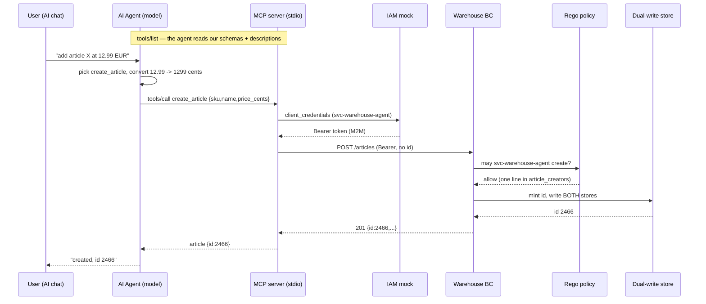

# Restitution — Phase 11: the Warehouse BC speaks tools (Group 3)

> Versione italiana: [`restitution-IT.md`](./restitution-IT.md)
> Spoken restitution script for CP11 (~4 min). We compare the shape, not the syntax.

## Opening
We're Group 3. CP7 gave the BC an identity envelope and a first policy; CP9 made it publish facts.
CP11 adds a **new kind of caller**: AI agents. They do not read our REST API from a wiki — they speak
**MCP** (Model Context Protocol): they connect to a server, read the **catalogue of tools** it exposes,
and decide on their own, mid-conversation, whether and how to call them.

The server itself is **given** and deliberately thin: JSON-RPC in, authenticated HTTP against the BC
out. It holds **no business logic and no permission logic**. It authenticates with the
`client_credentials` grant as `svc-warehouse-agent` — exactly like any service since CP7 — and the
**policy we wrote decides what that identity may do**. The BC never learns an AI is calling. What was
missing were the **tools**: `get_article` is the worked example; we wrote **`list_articles`** (Task 1),
**`create_article`** (Task 2) and **`adjust_inventory`** (flex). The new skill is not the plumbing —
it is **writing a contract whose reader is a model**.

## The shape of a tool
Every tool is three surfaces the agent reads, none of which the compiler checks:
1. the **input schema** (typed struct + `jsonschema` descriptions) — read *before* the call, to decide
   whether and how to call;
2. the **output schema** — read to interpret the result;
3. the **error text** — read to recover on its own.

## Part 1 — `list_articles` (shape the surface)
`GET /articles` returns **everything** and takes no filters: fine for a program, hostile for a
conversation. The tool shapes the surface: fetch all, filter **case-insensitive on SKU and name**, cap
at `limit` with a **default of 20**. The prose does the real work — each field says what it means *and
what happens when omitted* ("omit to browse the whole catalogue, still capped by limit"), because the
agent picks `query` and `limit` from that text alone. The default cap matters more than it looks: without
it, one innocent "what do we have?" pulls all 201 articles into the model's context.

## Part 2 — `create_article` (a WRITE tool)
A tool that **writes** raises the bar on the description: the text must make unmistakable that this has a
**permanent side effect**, when it is appropriate, and that `price_cents` is **integer cents, never a
decimal**. The handler: reject empty SKU/name **locally, without burning a BC round-trip**; default
currency to EUR; `POST /articles` **with no id** — the system of record mints it (CP4's dual-write). Two
BC answers are **decisions, not malfunctions**, so each gets a message the agent can act on: a **403**
names the policy ("do not retry — explain it"), a **400** says the article was rejected as invalid and
carries the BC's reason.

## Flex — `adjust_inventory`
The same pattern a third time, with one nuance: `delta` is **signed**, so the description gives an
example in **each direction** (positive receives units, negative writes them off) — "adjust by 5" is
ambiguous in a way an integer field cannot resolve. `reason` exists for the audit trail, and the schema
says so, so agents pass meaningful values. A **404** points the agent back at `list_articles`.

## The identity thread: not a back door
The agent is **not** a special door into the BC. The MCP server obtains an M2M token via
`client_credentials` as `svc-warehouse-agent`; the BC sees a **Bearer token like any other service
traffic**, runs the same auth middleware and the same **Rego policy** from CP7. The whole "may the agent
create?" is **one line** — `"svc-warehouse-agent"` in `article_creators` in
[`policies/warehouse.rego`](./policies/warehouse.rego). Authorization lives in the BC, once, for every
caller.

## How we proved it
- **Tests** (`docker compose run --build --rm test`): green — the ten `list`/`create`/`adjust` tests that
  shipped red, plus the given `get_article` three.
- **Schemas register**: the tests exercise only the handlers, so the descriptions are validated only at
  **registration**. We drove the real server over stdio: `tools/list` returned **4 tools** with our
  descriptions, and it served without a panic.
- **On the wire, through the real MCP server**: `list query="cloud" limit=3` → 3 real matches
  (`VM Cloud Enterprise`, `Storage Cloud Lite`, `Workspace Gold`); `list` with no args → **20** (the
  default cap over 201). `create_article` → the BC minted **id 2466**, currency defaulted to **EUR**, and
  the same id landed in **both** stores — `warehouse_db.articles` as `1990` cents and `mic.business_data`
  as `19.9000` (the reverse-ACL at the boundary). The agent's write went through **our policy** and the
  **dual-write** like any CP7 caller.
- `git diff` touches **only** the three starter tool files.

## The call path


## The five questions (Q1–Q5)
**Q1 — the MCP server contains zero permission checks; where is "may the agent create?" decided, which
single line grants it, and why is that better than a check inside the MCP server?** It is decided in the
**BC's Rego policy** (`policies/warehouse.rego`), written in CP7; `middleware.Can` only translates the
AuthContext into the policy's input. The granting line is **`"svc-warehouse-agent"` in
`article_creators`**. Keeping the decision in the BC means **every** path — UI, service, agent — hits the
same rule. A check inside the MCP server would be a **second authorization system** that the next caller
(a different agent, a script) simply bypasses.

**Q2 — who reads your `jsonschema` descriptions, and when; what breaks when they are vague: compile time,
call time, or conversation time?** The **model** reads them, at the moment it decides **whether and how**
to call the tool. Nothing breaks at compile time, and the tests never see them — that is exactly why the
tests **cannot** check them and the agent-in-the-loop step exists. Vague descriptions break the
**conversation**, and they break it **silently**: the agent picks the wrong tool, omits a filter, or
passes a decimal where cents were meant.

**Q3 — the BC was not touched this phase; what does it see when the agent calls, and which phase built
that machinery?** It sees a **Bearer token from the `client_credentials` grant and ordinary HTTP** — the
machinery of **CP7**. The BC **cannot tell an agent from any other service**, and that is the design
working, not a gap: no special door was cut for AI.

**Q4 — why do the tests insist errors name the failing id and suggest `list_articles`; who is the reader
of an error?** The reader is the **agent** (a model). An error that names the failing id and points at the
tool that can recover it — "`list_articles` shows the ids that do" — lets the agent **correct itself in
the next step**; a bare "failed" leaves it guessing or hallucinating. **Error text is part of the tool
contract**, as much as the input schema.

**Q5 — the agent acted with its own service identity; what is still missing before letting it act on
behalf of a user in production?** It acted as **itself** (`svc-warehouse-agent`), with **one global power
list**. Acting **on behalf of a user** needs: the **acting-for / on-behalf-of claim** (delegation), so the
BC knows which user is behind the agent; permissions **scoped to that user's visibility** (ADR-018's
cones), not a blanket grant; an **audit trail** that distinguishes "the agent did it" from "Alice did it
through the agent"; and **human confirmation on writes**.

## How to run it
```bash
cd phase-11-mcp
docker compose up -d --build                                  # MySQL + IAM + BC (:8083) + Adminer (:8082)
docker compose --profile mcp build mcp-server                 # the image the agent launches over stdio
docker compose --profile tools run --rm backfill-articles     # the stock the BC took ownership of
docker compose run --build --rm test                          # green suite (list/create/adjust)
# Connect an MCP agent from THIS folder (.mcp.json): /mcp -> approve warehouse-bc -> 4 tools.
# Ask it "what cloud articles do we have?" and "add a test article at 9.90 EUR".
docker compose down
```
The map: `8083` Warehouse BC · `8082` Adminer (server `integration-mysql`, root/root) · `9001` IAM mock.
The MCP server is **not** in `up`: the agent starts it over stdio, one process per session.

## Closing
Same shape as before — a contract in the middle, a default that fails safe, authorization in the BC — one
level up: the contract is now read by a **model**, and its quality is measured at **conversation time**,
not by a compiler. We added no door for the AI; we handed it the same identity every service already uses,
and let the CP7 policy do its job.

## Glossary
- **MCP (Model Context Protocol)** — how an agent discovers and calls tools: connect, read `tools/list`, `tools/call`.
- **Tool contract** — input schema + description + output schema + error text; all read by a model, none checked by the compiler.
- **`jsonschema` description** — the model-facing text that decides whether and how a field is used; validated only at conversation time.
- **M2M `client_credentials`** — the machine grant (CP7) by which the server authenticates as `svc-warehouse-agent`; the BC sees a Bearer token, not an AI.
- **`article_creators`** — the set in `policies/warehouse.rego` whose one line grants the agent write access.
- **Agent-in-the-loop test** — rebuild, reconnect, watch which parameters the agent picks: the only way to test the prose.
